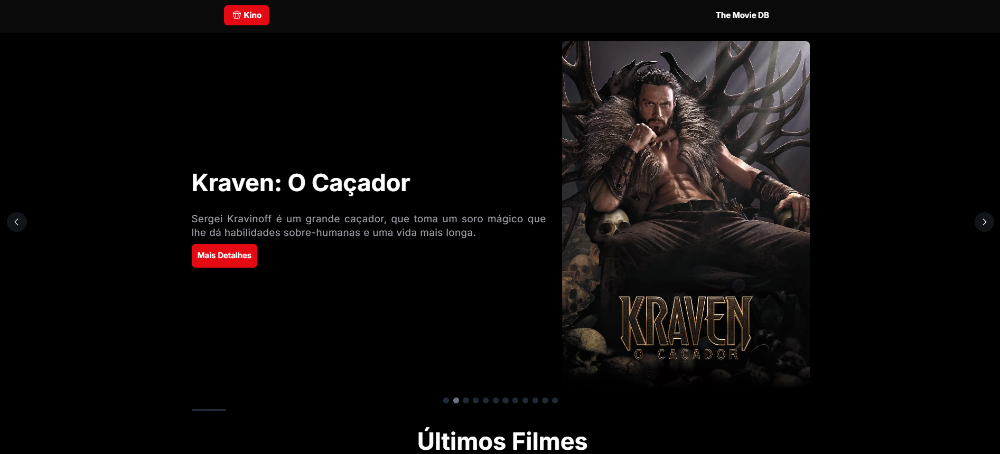
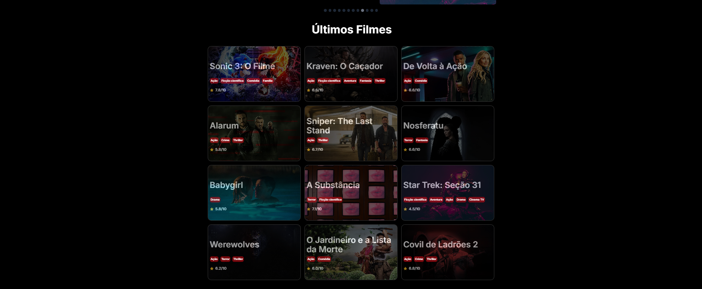
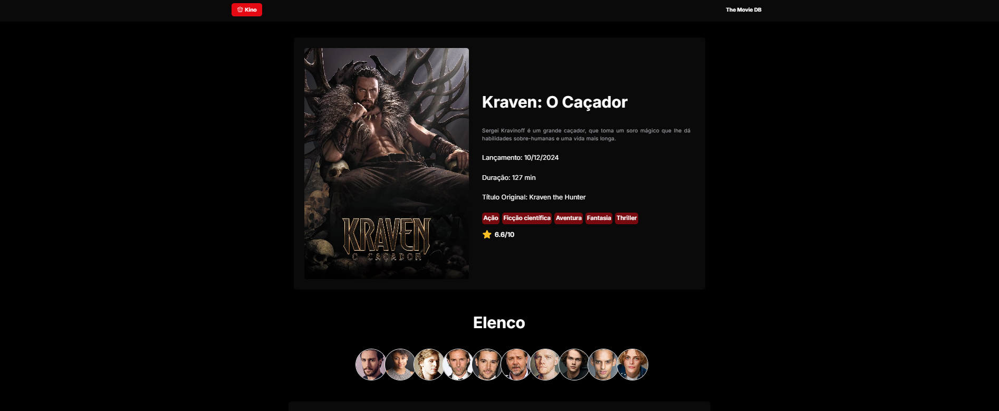

# 🎬 Kino

<div align="center">


<div>
  
  
  
</div>

<div>
  
  
  
  
  
  
</div>
</div>

Kino é uma plataforma desenvolvida para exibir os últimos filmes lançados no mercado. A aplicação permite que os usuários visualizem e naveguem pelos últimos lançamentos permitindo que os cinéfilos de plantão possam estar sempre atualizados com os lançamentos mais recentes e descobrir novos filmes para assistir.

A aplicação oferece uma navegação intuitiva e moderna, permitindo que os usuários explorem facilmente os últimos filmes lançados, garantindo que nenhum lançamento importante passe despercebido. Além de descobrir novos filmes, a aplicação também permite que os usuários se aprofundem no universo de cada filme através dos detalhes técnicos completos, informações sobre o elenco e fichas técnicas que proporcionam uma experiência informativa.

Além disso, a plataforma sugere automaticamente outras produções que compartilham características semelhantes ao filme selecionado, o que permite que os usuários descubram novos filmes que possam despertar seu interesse a partir de uma produção que já estejam explorando.

## 🖥️ Como rodar este projeto 🖥️

### Requisitos:

- [Node.js](https://nodejs.org/pt) instalado

### Execução:

1. Clone este repositório:

   ```sh
   git clone https://github.com/portfolio-projetos-dev/kino
   ```

2. Acesse o diretório do projeto:

   ```sh
   cd kino
   ```

3. Instale as dependências:

   ```sh
   npm install
   ```

4. Inicie o servidor (Next.js):

   ```sh
   npm run dev
   ```

5. Acesse o projeto em [http://localhost:3000](http://localhost:3000).

## 🗒️ Features do projeto 🗒️

<div style="display: flex; gap: 8px; justify-content:center; margin:15px">
   
   
   
</div>

- Catálogo com os últimos filmes lançados
- Informações completas sobre cada produção
- Ficha técnica detalhada de cada filme
- Dados sobre direção e aspectos técnicos do filme
- Informações como ano de lançamento, duração e classificação indicativa
- Galeria dos atores principais
- Informações sobre personagens interpretados
- Mini-biografias e principais trabalhos dos artistas
- Recomendações de filmes relacionados
- Interface responsiva e moderna

## 💎 Links úteis 💎

- [The Movie DB](https://www.themoviedb.org)
- [Next.js](https://nextjs.org/docs)
- [TypeScript](https://www.typescriptlang.org/docs)
- [Shadcn](https://ui.shadcn.com)
